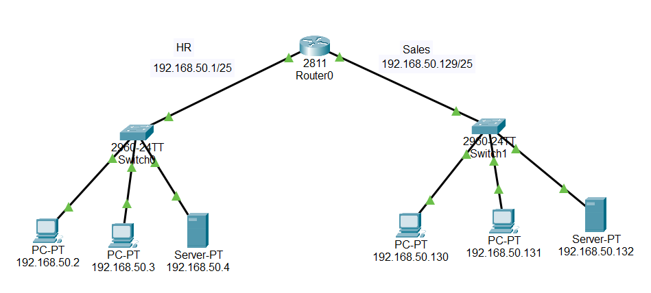
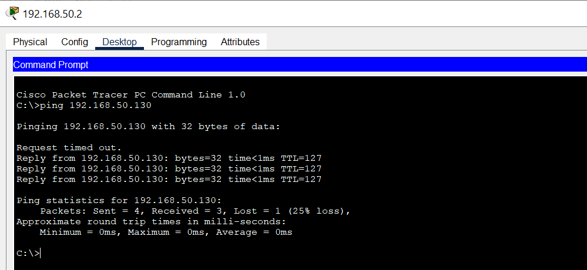

# 🏢 Small Office Network Project

## 📘 Overview
This project represents a **Small Office Network** designed in **Cisco Packet Tracer** to connect two departments:  
**Human Resources (HR)** and **Sales**.  
The main goal is to enable secure and reliable communication between the two departments using **static routing**.

---
## 🖼️ Network Topology
Below is the network diagram showing the connection between the HR and Sales departments:

## 🧩 Network Components

- **2 Routers (Router-PT)** – configured with *static routing* to interconnect HR and Sales departments.  
- **2 Switches (Switch-PT)** – used to connect end devices and servers within each department.  
- **4 PCs** – two PCs for each department to simulate employee workstations.  
- **2 Servers (Server-PT)** – generic Packet Tracer servers configured for basic local services and testing connectivity between departments.

---

## ⚙️ Main Configurations

- **Static routing** between routers for inter-department communication.  
- **Manual IP addressing** for all devices.  
- **Basic switch setup** to connect PCs and servers.  
- **Connectivity verified** using ping tests between all devices.

---
## 🖼️ Ping and Testing
Below is the network ping and tesing:

---
## 👨‍💻 Author
**Abderrahmane Makhlouf**   
📧 Contact: [Contact@abderrahmanemakhlouf.com]
